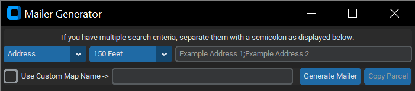

# Mailer Generator
Generates the Mailing List and Mailing List Map needed by Development Services.  

 

## Dependencies

### ArcPy

&nbsp;&nbsp;&nbsp;&nbsp;*ArcPy is a Python site package that provides a useful and productive way to perform geographic data analysis, data conversion, data management, and map automation with Python.*
* Version 3.1.1 or higher.
* Installed with [ArcGIS Pro](https://www.esri.com/en-us/arcgis/products/arcgis-pro/overview).

### CustomTkinter

&nbsp;&nbsp;&nbsp;&nbsp;*With CustomTkinter you can create modern looking user interfaces in python with tkinter. CustomTkinter is a tkinter extension which provides extra ui-elements like the CTkButton, which can be used like a normal tkinter.Button, but can be customized with a border and round edges.*
* Version 0.3 or higher.
* `pip install customtkinter`

### Show in File Manager

&nbsp;&nbsp;&nbsp;&nbsp;*Show in File Manager is a Python package to open the system file manager and optionally select files in it. The point is not to open the files, but to select them in the file manager, thereby highlighting the files and allowing the user to quickly do something with them.*
* Version 1.1.4 or higher.
* `pip install show-in-file-manager`

### win11toast

&nbsp;&nbsp;&nbsp;&nbsp;*Toast notifications for Windows 10 and 11 based on WinRT*
* Version 0.32 or higher.
* `pip install win11toast`

## Usage Instructions

1. Open `Mailer Application.pyw`
2. Select the field to search for from the dropdown.
    * Address
    * Tract ID
    * Assessor Number
3. Enter your search criteria into the text box, separate multiple criteria with a semicolon - case insensitive.

    *Examples*
    * Address - `201 1st Ave E`
    * Tract ID - `2821X18-KOT-17-W69-BLK57`
    * Assessor Number - `E001067`
4. By default, the first search criteria will be converted to proper case and used to title the map layout as well as the filename, if you desire a different map title and filename, check the &nbsp;`Use Custom Map Name ->` checkbox and enter your title in the text box - CASE SENSITIVE!
5. Click `Generate Mailer`, at which point the GUI will hang - ArcPy does not support multithreading, as a result the user interface will freeze while the geoprocessing work is being done.  Once complete, depending on the result the tool will do one of two things:
    1. If your search string is not found in the specified field of the parcel data, a toast notification will display the field searched, and the search string.
    2. If your search string is found in the specified field of the parcel data, geoprocessing will run and generate two files:
        * The mailing list map in .pdf format.
        * The mailing list spreadsheet in .xlsx format.
    3. After the files are generated, a toast notification will be displayed with the map name.  If you click the notification, a file explorer window will be opened to each file so they can be easily attached to an email.
